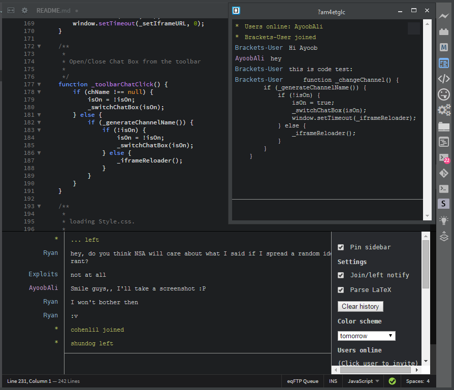

# Hack.Chat Integration

This is an extension to integration [hack.chat](https://hack.chat/) with [Brackets](http://brackets.io). 

Feel free to fork or use the code for any other extension.

### Installation

* Select **File > Extension Manager...** (or click the "brick" icon in the toolbar)
* Click **Install from URL...** or search for **Hack.Chat Integration**
* Enter the url of this repo: https://github.com/AyoobAli/brackets.hack.chat
* Click **Install**

### How to use

 * Go to "Navigate" => "Hack.Chat - Change Channel"
    * Or click Hack.Chat icon on the toolbar.
 * It will auto generate a random channel name, then will ask you if you want to change it.
    * You can leave the channel room empty to enter the main page and select one of the main channels.

#### TODO:

 - Option to switch the Chat panel between bottom and sidebar.
 - Option to change the main server (https://hack.chat/).
 
#### Update

 - _v0.0.2_ - 14/07/2015
    - By [ToastyStoemp](https://github.com/ToastyStoemp): When channel is entered with or without '?' it will connect to the same channel.
